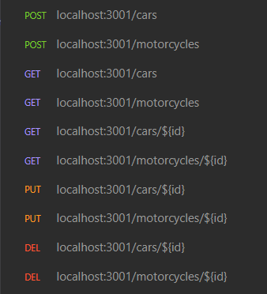

# Boas-vindas ao repositório do projeto API Car Shop!

Projeto desenvolvido durante o modulo de backend na [Trybe](https://www.betrybe.com/).
- Nesse projeto foi proposto desenvolver uma aplicação seguindo os princípios de Programação Orientada a Objetos (`POO`) para a construção de uma API com `CRUD` para gerenciar uma concessionária de veículos. Isso foi feito utilizando o banco de dados `MongoDB`.

## Requisitos
- [Node](https://nodejs.org) versão LTS
- [npm](https://www.npmjs.com) ou [yarn](https://yarnpkg.com/getting-started/install)
- [Docker](https://www.docker.com/)
- [MongoDB](https://www.mongodb.com/)

## Tech Stack :rocket:

- [Typescript](https://www.typescriptlang.org/)
- [Node](https://nodejs.org)
- [Express](https://expressjs.com)
- [Mongoose](https://mongoosejs.com/)
- [Zod](https://github.com/colinhacks/zod)
- [Jest](https://jestjs.io/pt-BR/)

## Instruções

#### 1. Clone o repositório
- Use o comando: `git clone git@github.com:LeonardoMonti/car-shop-api.git`
- Entre na pasta do repositório que você acabou de clonar:
  - `cd car-shop-api`
#### 2. Instale as dependências
  - Execute `npm install`

#### 3. Você irá precisar configurar as variaveis de ambiente
  - Renomeie o arquivo `.env.example` para `.env`
  - Abra o arquivo `.env` e certifique-se que a url do banco mongo esteja correta.
    - IMPORTANTE configurar as variáveis: `MONGO_URI`, `PORT`.
    - Você pode usar esse [Conteúdo de variáveis de ambiente com NodeJs](https://blog.rocketseat.com.br/variaveis-ambiente-nodejs/) como referência.

#### 4. Caso nao tenha o MongoDB instalado em sua máquina e deseje usar o Docker 🐋, siga os passos
  - 1. Baixe a imagem do MongoDB:
    ```http
    docker pull mongo
    ```
  - 2. Crie o contêiner do MongoDB:
    ```
    docker run --name <nome-do-container> -p 27017:27017 -d mongo
    ```
  - 3. Confira se o contêiner está rodando:
    ```
    docker ps
    ```

<details>
  <summary><strong>Endpoints 📷</strong></summary>

---



---

</details>

#### 5. Inicie o servidor rodando `npm run dev` basta acessar [http://localhost:3001](http://localhost:3001)
```http
  {
    "message": "connect car shop API"
  }
```

---

## Meu [Linkedin](https://www.linkedin.com/in/leonardomonti/)
